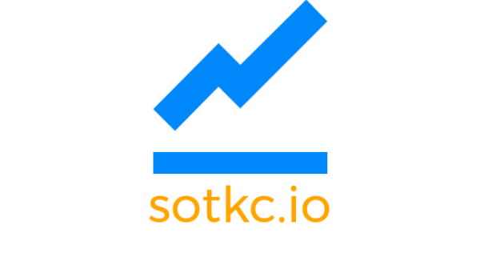

<p align="center">
  
</p>

## About

This project was made in order to complete an assignment on the course [Vue JS 2 - The Complete Guide](https://www.udemy.com/vuejs-2-the-complete-guide/).
You can test it on this [link](https://andre000.github.io/sotkc/)

### What it's supposed to do

- Load a list of available stocks
- Buy and Sell stocks
- Proceed to the next day
- Save and Load state

### Dependencies
- Vue
- Vue Router
- Vuex
- Axios
- [Vuikit](https://vuikit.js.org/)
- [IEX Developer Platform API](https://iextrading.com/developer/)
- [TimelineLite](https://greensock.com/timelinelite)

---

#### Project setup
```
npm install
```

#### Compiles and hot-reloads for development
```
npm run serve
```

#### Compiles and minifies for production
```
npm run build
```

#### Lints and fixes files
```
npm run lint
```
